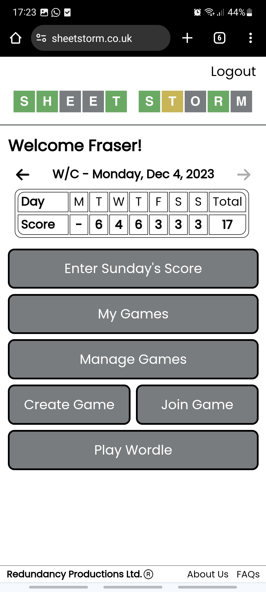

# Sheet Storm

Sheet Storm is a mobile website which allows friends to keep track of their own Wordle scores and crown a winner at the end of each week.

Users can create lobbies and then share the password with friends so that they can join. Don't forget to enter your score every day to give yourself the best chance at being crowned Wordler of the Week!

Sheet Storm can be accessed at [sheetstorm.co.uk]("https://sheetstorm.co.uk/login"). Don't forget it is a mobile only website so may appear stretched in desktop browsers.

<table width="100%">
  <tr>
    <td><h2 align="center" width="33%">Login Page</h2></td>
    <td><h2 align="center" width="33%">Main Menu</h2></td>
  </tr>
  <tr>
    <td width="50%"></td>
    <td width="50%"></td>
  </tr> 
</table>

<table width="100%">
  <tr>
    <td><h2 align="center" width="33%">Manage Games Page</h2></td>
    <td><h2 align="center" width="33%">Main Menu</h2></td>
  </tr>
  <tr>
    <td width="50%"></td>
    <td width="50%"></td>
  </tr> 
</table>

## Tech Stack

Sheet Storm was developed using a MERN tech stack; MongoDB, Express, React, and Node. The website is hosted using AWS Lightsail.
